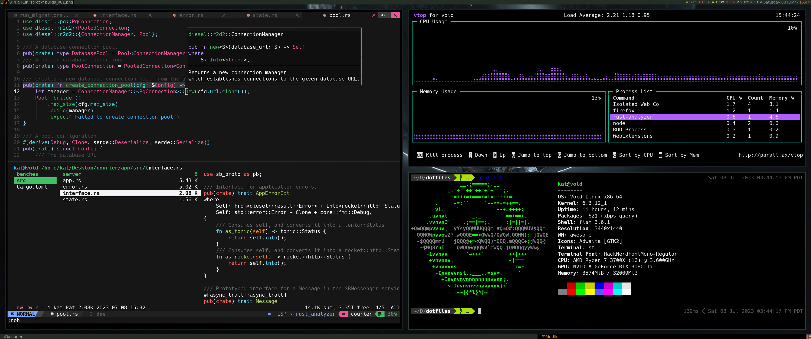

# NAVI
> [phasewalk1](https://github.com/phasewalk1) drivers. custom builds for _awesome_, _fish_, _neovim_, and _picom_. also included are my _ergodox bindings_, _fonts_, and _.xinitrc_.

> _Magnified neovim dash_

